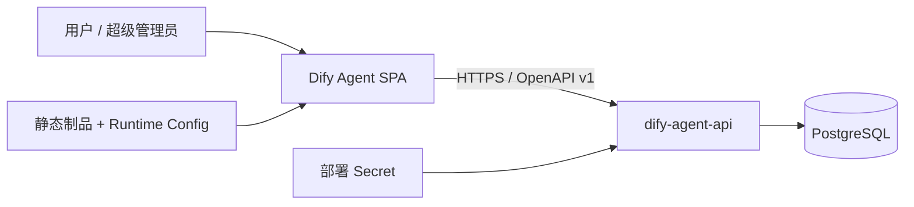

# Dify Agent 前端架构

## 1. 选型与范围

本项目是 `medium` 档位的 `browser-spa`，只交付 React SPA、静态资源、前端构建和部署配置。Go API、PostgreSQL、迁移与服务端 Secret 位于独立的 `dify-agent-api` 仓库，两个部署单元只通过锁定版本的 OpenAPI 与 HTTPS 通信。真实配置见 `architecture-profile.yaml`。

## 2. 系统上下文



当前唯一业务模块是 `auth`，其边界是注册、登录、会话恢复、注销与展示当前身份。后续只在出现稳定业务边界和真实 owner 时增加模块，不预建空 Repository、Entity、Store 或 Domain。

```text
src/
├── app/                       # Bootstrap、Provider、Router、静态 Module Catalog
│   └── i18n/                  # 汇总各模块消息资源并初始化 i18next
├── generated/dify-agent-api/ # OpenAPI 生成类型与 Zod Schema，禁止手改
├── modules/auth/
│   ├── application/           # AuthGateway port 与命令
│   ├── infrastructure/        # HTTP adapter、响应校验、token 内存管理
│   └── presentation/          # 登录、注册与身份页
├── shared/http/               # 唯一通用 HTTP client
└── styles/                    # 全局主题入口与设计 Token；业务样式在各模块就近的 *.module.css
```

## 3. 依赖、状态与契约

依赖方向固定为 `presentation → application ← infrastructure`。Application 拥有认证命令、用户视图和稳定错误，不暴露生成的 Transport DTO；Infrastructure 负责生成 DTO、HTTP 错误与 Application 契约之间的映射。Presentation 不得直接 `fetch` 或依赖 Infrastructure；所有远程 I/O 经 `AuthGateway` 和唯一 `HttpClient`。`HttpClient` 基于浏览器 `fetch` 提供 `GET`、`POST`、`PUT`、`PATCH`、`DELETE`，统一处理 JSON、Cookie、内存 bearer token、超时、取消及标准响应解包；当前能力不引入 Axios，避免重复网络栈和无必要依赖。这些方向由 ESLint、dependency-cruiser 和直接 fetch 检查共同阻断。

API 成功响应固定为 `code / message / requestId / data`，错误响应固定为 `code / errorCode / message / requestId / errors?`。数字 `code` 必须等于实际 HTTP 状态码；稳定字符串 `errorCode` 表达业务失败原因。Zod 在 Infrastructure 边界校验全部成功和错误响应，并拒绝响应体 `code` 与 HTTP 状态不一致的错误；界面只根据已知 `errorCode` 映射 i18n 消息，不直接展示远端 `message`。TanStack Query 是远程会话状态的唯一缓存，RHF 拥有表单，React state 只保存登录/注册模式。i18next 是界面语言和文案资源的唯一 owner：启动时从浏览器偏好检测 `zh-CN` 或 `en-GB`，语言切换只在当前页面会话生效，不写入浏览器持久化；日期与数字统一通过语言上下文封装的 `Intl` 格式化。每个业务模块在自身 Presentation 边界维护按消息键组织的双语资源，中英文必须并排且完整；`app/i18n` 是唯一资源组合与 i18next 初始化点，组件只使用稳定消息 id。

`contracts/dify-agent-api/v1/openapi.yaml` 与 `.sha256` 是唯一 transport 来源。`pnpm generate:api` 产生只读类型和 Schema，`generated:check` 在临时目录重新生成并进行逐文件零漂移比较。Runtime Config 必须同时匹配 contract id 与 SHA-256；远程 API 必须使用 HTTPS，配置不合法时应用 fail-closed。

本地开发先运行 `pnpm runtime-config:init` 创建或同步被 Git 忽略的 `public/runtime-config.json`；该命令刷新契约字段，但保留已有 API 地址与 release id。`pnpm dev` 启动前执行非修改型 `runtime-config:check`，配置缺失、格式错误或契约过期时立即失败。`profile:check` 同时保证版本化示例配置与 Profile 一致。

## 4. 认证与安全

认证策略由 [ADR 0001](docs/adr/0001-local-auth-session.md) 固化。用户凭据只发送给 Go API；短期随机 access token 仅在 `HttpClient` 内存保存，长期 refresh token 仅由服务端 HttpOnly、SameSite Cookie 承载。前端启动调用 refresh 恢复会话；Query 的取消信号贯穿 Gateway 到 fetch，Mutation 由组件生命周期统一取消。注销无论服务端响应如何都清除内存 token 和 Query 会话。错误界面只映射 Application 的稳定错误码，不展示服务端原文或敏感数据。

`auth` 模块不自行判断或提升角色；超级管理员身份完全来自后端验证后的 `UserResponse.role`。前端仅据此展示身份状态，所有权限控制仍必须由 API 执行。

## 5. 体验、交付与验收

界面使用语义化 HTML、键盘可达控件、清晰焦点态与响应式布局，目标为 WCAG 2.2 AA。视觉系统采用深色矿物色基底与低饱和海沫绿单一强调色，通过语义 Token 组合半透明表面、折射高光、模糊和内嵌阴影形成液态玻璃层次；动态只使用 GPU 友好的位移与透明度，并为 `prefers-reduced-motion` 提供静态回退。所有用户可见文案由 i18next 管理；启动配置失败使用最小静态故障页，因为 i18n 本身尚未安全启动。

HeroUI v3 是交互控件、反馈状态和容器组件的唯一基础体系，业务样式只通过组件公开属性、公开 className、就近的 `*.module.css` 和语义 Token 扩展。`src/styles/tokens.css` 维护按浅到深排序的原始调色板，并映射为颜色、排版、间距、圆角和阴影的语义 Token；业务 CSS 只能使用语义 Token，未来主题仅重映射该语义层。除 `src/styles/theme.css`（入口与基础重置）和 `src/styles/tokens.css` 外，不得新增全局 CSS。动作和选择控件使用 HeroUI 所依赖的 `react-aria-components` 公开 `Button`、`RadioGroup`、`Radio` 原语，并只组合 HeroUI 公开的对应 variants；该依赖必须精确锁定，禁止本地适配器、类型断言、依赖补丁、`skipLibCheck` 或其他绕过方式。原生 HTML 仅用于文档和语义结构，不承担交互控件。

生产构建路由级拆包并执行 gzip 预算：初始 JavaScript 不超过 150 KiB，CSS 不超过 75 KiB。静态制品与公开 Runtime Config 分离发布，部署时从 `public/runtime-config.example.json` 生成实际 `runtime-config.json`，不得把 token、密码或数据库信息写入其中。

合并前执行 `pnpm verify`，覆盖 Profile、契约生成漂移、格式、类型、Lint、依赖环、架构图、覆盖率阈值、Chromium E2E、axe 可访问性、生产构建、依赖漏洞、许可证与 Secret 检查。GitHub Actions 使用 `CONTRIBUTING.md` 规定的稳定 Required Check id 重跑相同权威脚本。认证需求、残余风险、SLO、Runbook 与数据清单分别维护在 `docs/requirements-risk-matrix.md`、`docs/slo.md`、`docs/runbook-authentication.md` 与 `docs/data-classification.md`。
