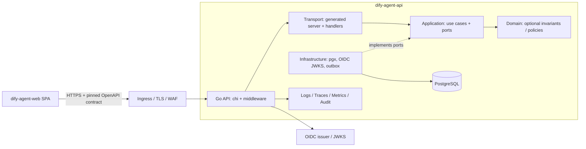

# Dify Agent Go 服务端建设架构

## 1. 定位、范围与边界

本文件定义未来独立服务端项目 `dify-agent-api` 的建设基线。该项目向 `dify-agent` 浏览器 SPA 提供 HTTPS API、身份边界、业务规则、PostgreSQL 持久化、审计与运维能力。

服务端必须是独立仓库或独立部署单元：

```text
dify-agent-web/       # 当前 React browser SPA
dify-agent-api/       # Go API、数据库迁移、OpenAPI、服务端运维资产
```

本文件不授权在 `dify-agent-web` 的 `src/`、构建产物或前端部署单元中加入 Go、数据库、迁移、服务端密钥或后台任务代码。前后端只经版本化 OpenAPI 契约和 HTTPS 通信。

服务端不承担浏览器静态资源托管、BFF 式页面编排或“万能代理”职责；它只提供经过认证、授权、校验和审计的领域 API。

## 2. 技术基线

| 领域       | 选择                           | 约束                                                          |
| ---------- | ------------------------------ | ------------------------------------------------------------- |
| 语言与模块 | Go Modules                     | 使用团队锁定的受支持 Go 版本；提交 `go.mod` 与 `go.sum`。     |
| HTTP       | `net/http` + `chi`             | 仅使用标准 `net/http` 兼容 middleware；不引入第二路由框架。   |
| API 契约   | OpenAPI 3.0 + `oapi-codegen`   | Schema、生成器和配置精确版本锁定；生成代码不可手改。          |
| 数据库     | PostgreSQL + `pgx` / `pgxpool` | 生产只支持 PostgreSQL；Repository 使用参数化 SQL 和显式事务。 |
| 迁移       | 单一迁移工具                   | 迁移顺序不可改写；工具、版本和 checksum 必须锁定。            |
| 配置       | 环境变量载入后 Schema 校验     | 启动前 fail-closed；密钥不进入仓库、日志或 OpenAPI。          |
| 可观测性   | `log/slog` + OpenTelemetry     | 日志、trace、metric 与 audit 具有稳定字典和 request id。      |
| 本地开发   | Docker Compose + PostgreSQL    | SQLite 只允许一次性原型，不得作为生产或集成测试等价物。       |

`pgx` 提供 PostgreSQL 原生接口、连接池和 PostgreSQL 特性支持；服务端只面向 PostgreSQL 时优先采用其原生接口。`oapi-codegen` 用于生成模型和 chi server 骨架，但生成器不会替代认证、授权、业务规则或端到端安全校验。[pgx 官方说明](https://github.com/jackc/pgx/)、[oapi-codegen 官方说明](https://github.com/oapi-codegen/oapi-codegen/)、[chi 官方说明](https://github.com/go-chi/chi)

## 3. 总体架构



依赖只能向内：`transport → application → domain`；`infrastructure` 实现 application port，并可依赖 domain。Domain 不得依赖 HTTP、chi、pgx、OpenAPI 生成物、配置、日志或外部 SDK。跨模块只允许通过公开 application contract，不得深层导入内部 package。

## 4. 项目结构

```text
dify-agent-api/
├── cmd/api/main.go                 # 组装依赖、启动与优雅关闭
├── api/openapi/v1/openapi.yaml     # 唯一 HTTP 契约源
├── api/openapi/v1/openapi.sha256   # 前端与发布使用的精确摘要
├── internal/
│   ├── platform/
│   │   ├── auth/                   # OIDC JWT 验证与 capability view
│   │   ├── config/                 # 已校验的运行时配置
│   │   ├── database/               # pgxpool、事务、迁移健康检查
│   │   ├── http/                   # middleware、错误映射、request id
│   │   └── observability/          # slog、OTel、audit 接口
│   └── modules/
│       └── agent/
│           ├── application/
│           │   ├── ports/
│           │   └── usecases/
│           ├── domain/             # 仅在存在真实不变量时创建
│           ├── infrastructure/
│           │   └── postgres/
│           ├── transport/http/
│           └── public.go
├── migrations/                     # 只增不改的 SQL 迁移
├── generated/                      # OpenAPI 生成物，禁止手改
├── deploy/                         # 容器、运行时配置 Schema、部署策略
├── test/                           # 集成、契约、端到端测试基础设施
├── Dockerfile
├── compose.yaml                    # 仅本地 PostgreSQL 依赖
├── go.mod
└── go.sum
```

不要预建空模块、Repository、Entity、Service、Domain 或 `utils` 包。首个真实业务能力以完整 vertical slice 创建一个模块；静态展示或健康检查不伪装成业务模块。

## 5. HTTP 与 OpenAPI 契约

### 5.1 契约优先

`api/openapi/v1/openapi.yaml` 是唯一 HTTP transport 来源，定义路径、参数、请求、响应、错误、认证 scheme、分页、幂等键和 trace/request id。任何端点变更必须在同一变更中完成：

1. 更新 OpenAPI 及其摘要。
2. 重新生成 Go transport/model 代码并执行零漂移检查。
3. 更新前端锁定的 artifact、digest 和生成客户端/Schema。
4. 增加成功、非法输入、未认证、未授权、冲突、超时与取消的契约测试。

生成物仅位于 `generated/`。业务 handler 必须适配生成 interface，不得修改生成文件、复制 DTO 或以手写类型绕过 Schema。

### 5.2 Handler 职责

Handler 只负责：解析已生成的请求类型、调用已认证身份上下文、执行输入校验、调用 Use Case、映射稳定响应和错误。Handler 不得直接写 SQL、决定业务状态机、构造权限规则或调用未注册外部服务。

所有错误使用稳定结构：

```json
{
  "code": "AGENT_NOT_FOUND",
  "message": "Requested agent was not found.",
  "requestId": "01J..."
}
```

`message` 必须安全且可本地化；不返回 SQL、JWT、堆栈、内部 URL、租户信息或下游原文错误。

### 5.3 Middleware 顺序

中间件由外向内按以下顺序注册，并为每层提供测试：

1. request id、恢复 panic、结构化安全日志。
2. 可信代理配置下的 client IP 规范化；只能选择一种信任来源，不接受任意 `X-Forwarded-For`。
3. 严格 CORS allowlist、请求体大小、Content-Type、路径规范化与服务器超时。
4. OIDC access token 验证、issuer/audience/expiry/签名/JWKS 轮换验证。
5. capability/权限检查、限流、幂等键和审计上下文。
6. 路由、handler、Use Case 与错误映射。

## 6. 身份、权限与租户隔离

浏览器使用 Authorization Code + PKCE 与受信 Identity Provider 交互；Go 服务仅验证 access token，不在业务 API 中接收密码或自行保存浏览器 token。

认证层必须验证签名、issuer、audience、过期时间、not-before、算法 allowlist 和 JWKS key rotation。应用层从经过校验的 `Identity` / `CapabilityView` 读取主体和能力，禁止 handler 自行解析 claim 或仅根据前端传入角色授权。

若未来启用多租户：

- 租户 id 必须来自经验证 claim 或服务端解析的资源归属，不能直接信任请求字段。
- 所有 Repository 查询和唯一索引必须含租户边界。
- 日志、trace、cache key、outbox 和审计记录必须保留隔离维度。
- 增加跨租户负向测试；任何漏过滤都阻断合并。

## 7. PostgreSQL 与迁移

生产与集成测试使用 PostgreSQL；本地通过 Docker Compose 提供同主版本服务。SQLite 可以用于一次性、离线原型，但不得进入生产配置、迁移验证、性能结论或契约测试结论。

Repository 通过 `pgxpool.Pool` 获取连接，所有 I/O 接收并传播 `context.Context`。写入 Use Case 用显式事务封装；事务只覆盖必要数据库操作，不包含远程 HTTP、长计算、文件操作或消息等待。

迁移规则：

- 迁移文件按单调版本创建，只追加，不重命名、不修改已发布迁移。
- 每个迁移必须包含可审查的 forward SQL、锁/耗时评估、回滚或前向修复策略。
- 破坏性 Schema 采用 expand → backfill → cutover → contract，不能在同一发布直接删除被运行中版本使用的列。
- 所有唯一约束、外键、索引、软删除和数据保留策略由迁移明示，不由 ORM 隐式生成。
- 应用启动不自动执行生产迁移；迁移是独立、可审计的发布步骤。

## 8. 配置、密钥与外部 I/O

配置只从部署平台注入的环境变量或受管密钥设施读取，启动时解析为不可变结构并严格校验。任何缺失、格式错误、未知字段、非 HTTPS 外部 origin 或未配置的 OIDC/数据库参数都必须拒绝启动。

数据库 URL、OIDC issuer、审计 endpoint、CORS origin、超时、body limit、限流策略和发布 id 必须有唯一配置 owner。Secret 只在受管密钥系统中存在；不得写入 `.env.example`、日志、错误、fixture、容器层、OpenAPI 或前端 Runtime Config。

外部 I/O 必须设置超时、取消、有限重试、幂等性和资源释放。HTTP client 按目标 host 建立 allowlist；不得实现接受任意 URL、Method、Header 或路径的“通用代理端点”。

## 9. 可观测性与审计

每个请求生成或传播 request id、trace context 和安全的主体/租户摘要。日志使用结构化 `slog`；字段字典由仓库统一管理，禁止记录 token、authorization header、密码、完整 PII、SQL 参数或未净化错误。

至少建立：

- 指标：请求量、错误率、延迟、数据库连接池、迁移状态、认证失败、限流拒绝。
- Trace：HTTP → Use Case → Repository / 外部调用链路。
- Audit：身份、动作、目标资源、结果、request id、时间与最小必要上下文。
- Runbook：认证故障、数据库不可用、迁移失败、错误率升高、限流异常和回滚。

## 10. 测试与质量门禁

| 层级             | 最低验证                                                              |
| ---------------- | --------------------------------------------------------------------- |
| Domain（存在时） | 不变量、状态流转、边界和负向路径；高风险规则 100% 分支。              |
| Application      | Port fake 下的成功、权限、冲突、取消和事务意图。                      |
| Repository       | 对真实 PostgreSQL 的迁移、约束、事务、隔离和查询测试。                |
| Contract         | OpenAPI 请求/响应、非法输入、认证、授权、错误码和分页。               |
| HTTP 集成        | middleware 顺序、body limit、CORS、超时、request id、panic recovery。 |
| E2E              | SPA → Go API → PostgreSQL 的核心流程与关键负向路径。                  |

CI 至少执行：

```text
gofmt check + go vet + staticcheck + govulncheck + unit
→ migration validation + PostgreSQL integration + OpenAPI generation drift
→ contract + HTTP integration + race detector
→ container build + SBOM + license + secret + SAST
→ core E2E + deployment smoke
```

禁止 `t.Skip`、无界 retry、长期 baseline、扩大 coverage exclude 或用 mock 替代数据库迁移验证。`go test -race ./...` 是服务端共享状态和并发变更的必经门禁。

## 11. 本地开发与交付

本地开发通过 `compose.yaml` 启动 PostgreSQL，凭据仅限本机开发值且不进入 Git。服务启动顺序为：验证配置 → 检查数据库可达/迁移版本 → 建立连接池与 telemetry → 启动 HTTP listener；任一步失败即退出。

健康端点分离：

- `livez`：进程存活，不访问下游。
- `readyz`：数据库、配置和必要依赖已就绪。
- `version`：仅输出 release id、构建摘要和 OpenAPI digest，不输出环境或 secret。

发布制品使用多阶段、最小运行时、非 root 容器和内容寻址镜像。应用与迁移分别发布；回滚必须兼容数据库 expand 阶段，不依赖现场改库或手工修改运行中容器。

## 12. 与前端的契约协作

服务端发布 OpenAPI artifact、SHA-256、contract id 和兼容性说明。前端在其 `architecture-profile.yaml` 锁定这些值，并在启动/部署阶段校验 artifact、Runtime Config 和 API contract id 一致。

服务端不得为了旧前端长期维护第二实现或未记录兼容分支。任何破坏性 API 变化必须：建立 ADR、在前后端同一发布计划中迁移、更新 E2E，并在稳定入口切换前删除旧契约。

## 13. 启动前验收

开始首个服务端业务模块前，必须满足：

1. 已创建 `dify-agent-api`，没有把服务端代码置入当前 SPA 仓库。
2. Go 版本、依赖、迁移工具、PostgreSQL 版本和容器基线已锁定。
3. OpenAPI、错误契约、OIDC issuer/audience、CORS allowlist、数据库配置和 owner 已有真实值。
4. CI、CODEOWNERS、分支保护、Secret/SAST/供应链门禁已启用。
5. Docker Compose PostgreSQL、迁移验证、PostgreSQL 集成测试和一条 SPA → API → DB E2E 已通过。
6. Runbook、数据分类、保留策略、备份恢复和回滚策略已评审。

出现多服务编排、多租户隔离、异步任务/消息、SSE 与分片上传等两项以上扩展能力时，先建立 ADR，评估从单体 Go API 升级为明确的模块化服务架构；不得在没有边界的情况下逐步堆叠队列、worker 和第二 API。
