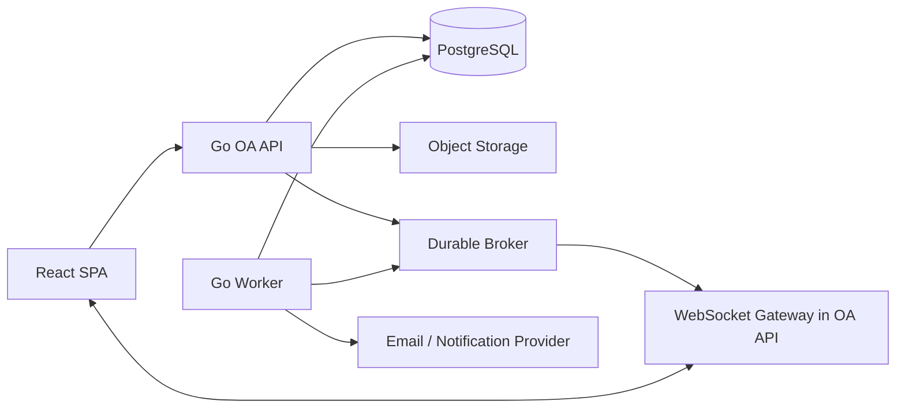

# 中型公司 OA 系统全局复核与一次性演进方案

> 状态：架构决策稿
>
> 依据：`general_architecture_projects`（React SPA）与相邻 `dify-agent-api`（Go API）当前代码、OpenAPI、迁移、测试和工程规范。
>
> 目标：把现有 Dify Agent 原型演进为单公司内部 OA，而不是在现有页面上叠加若干表单。本文只给出一个目标形态；不保留长期兼容接口、双模型、双权限体系、前端鉴权兜底或“临时”桥接代码。

## 1. 复核结论

此前按“组织 -> 工作台 -> 汇报/任务 -> 审批 -> 员工聊天”的优先级是正确方向，但不足以保证可交付性。当前系统具备认证和 Agent 问答的技术起点，却尚不具备 OA 的身份、授权、业务状态、异步投递、审计和数据治理底座。

因此，OA 的正确起点不是 P1 页面开发，而是一个**架构收敛阶段（P0）**：先消除契约事实源漂移、修正 Agent 模块边界、固化流式请求模型和生命周期、关闭内部 OA 不应具备的自助注册入口，并补齐审计、指标、后台任务和文件能力的基础设施决策。P0 未完成时，不得创建部门、审批、聊天或附件模块。

### 1.1 已验证的事实

| 事实                                              | 代码证据                                                                     | 对 OA 的含义                                             |
| ------------------------------------------------- | ---------------------------------------------------------------------------- | -------------------------------------------------------- |
| 前端只登记了 `auth` 和 `chat` 两个模块            | `src/app/module-catalog.ts`                                                  | 目前没有工作台、组织、通讯录、汇报、任务、审批或管理后台 |
| 已登录首页只有品牌栏与 Agent 抽屉                 | `src/modules/auth/presentation/authenticated-home.tsx`                       | 不能把它视为 OA 首页；需要重新建立应用壳与模块导航       |
| 后端持久化仅有 `users` 与 `auth_sessions`         | `migrations/000002_users_and_sessions.up.sql`                                | 没有员工、部门、授权、业务对象、审计或消息数据           |
| 角色只有 `user` 与 `super_admin`                  | `migrations/000002_users_and_sessions.up.sql`、`api/openapi/v1/openapi.yaml` | 不能表达主管、HR、财务、行政以及对象级数据范围           |
| Chat 是用户到 DeepSeek 的 SSE 问答                | `internal/modules/agent/**`、`src/modules/chat/**`                           | 它不是员工即时通信，不能复用为部门群或项目群             |
| 前后端工作副本持有相同 OpenAPI 文件摘要 `a6e...`  | 两端 `openapi.yaml` 与 `.sha256`                                             | 跨仓契约副本当前一致                                     |
| 后端 `architecture-profile.json` 仍写入 `f260...` | `dify-agent-api/architecture-profile.json`                                   | Profile 与实际契约摘要不一致，破坏“可校验事实源”的承诺   |
| 架构检查器确实会校验 Profile 摘要                 | `dify-agent-api/tools/architecturecheck/main.go`                             | 必须先修正事实源，不能把不一致留给后续 OA 改动           |

### 1.2 反思：不能沿用的假设

1. **“先做页面，后补权限”不可接受。** OA 的每一条查询和写入都依赖员工身份、组织归属、能力和数据范围。前端隐藏按钮不是授权。
2. **“把当前 Chat 改成企业聊天”不可接受。** 现有 Chat 的请求来自浏览器历史、响应不落库、使用 SSE、可选网页搜索；员工聊天需要成员关系、持久化、顺序、已读、撤回、留存、双向实时和权限审计。
3. **“先做泛化审批引擎”不可接受。** 在没有固定流程、业务字段和审批规则的情况下预建低代码引擎，只会得到无 owner 的抽象。首批流程应是受版本控制、强校验的请假和报销。
4. **“在 `users` 上不断加 OA 字段”不可接受。** 账号凭据、员工档案、组织任职和授权分属不同生命周期；把它们混入一个表会令离职、调岗、邀请、禁用和审计不可维护。
5. **“为了平滑升级保留旧 API/字段/权限分支”不可接受。** 本项目仍处于早期，正确做法是一次协调发布和明确切换，而非让旧模型长期存活。

## 2. 当前阻塞项

以下问题应在 OA P0 作为正式重构完成，不能以注释、豁免、前端判断或后续 TODO 处理。

### 2.1 契约与工程事实源不闭合

后端 Profile 的 SHA-256 与 `api/openapi/v1/openapi.yaml`、`openapi.sha256` 以及前端锁定 artifact 不一致。仓库的架构检查器把这一项视为硬错误，但当前文件仍漂移。

**一次性修复：**

- 以后端 OpenAPI 为唯一 transport 源，生成摘要与 Go transport。
- 将同一 artifact 和摘要同步到前端，再生成 TypeScript 类型/Zod Schema。
- 在同一变更更新后端 Profile、前端 Profile、runtime config 示例和跨仓 E2E 断言。
- 删除任何旧摘要、旧生成物和说明中已失效的值；不得接受双摘要或“允许任一摘要”的检查。

### 2.2 Agent 模块违反自身分层

`internal/modules/agent/transport/http/handler.go` 直接导入 `infrastructure/search`，并在 HTTP handler 内提取查询、调用外部搜索、拼接系统提示词。这同时违反后端架构中“transport 不依赖 infrastructure”和“handler 不承载业务编排”的规定。

**一次性修复：**

- 将 `SearchGateway` 定义为 Agent application port；在 application use case 内决定是否允许搜索、如何提取查询、如何限制结果以及如何构造 Agent 上下文。
- HTTP handler 仅做认证身份读取、请求解析、边界校验、调用 use case 和 SSE 写出。
- 在 composition root 中注入 DuckDuckGo adapter，不在 transport 反向导入 infrastructure。
- 当前 OpenAPI 的 `tools` 字段没有真实执行器、授权模型或审计语义，必须从 v1 合同、前端类型、内部 port 和测试中删除。以后有明确工具注册表、每个工具的 capability 和审计方案时，再用 ADR 引入。

### 2.3 流式请求的超时、错误和取消语义不可靠

后端将 `chimiddleware.Timeout(cfg.RequestTimeout)` 施加给全部路由；默认请求超时为 10 秒，HTTP 写超时为 15 秒（`server.go`、`config.go`）。与此同时，LLM gateway 的 `http.Client` 没有独立 timeout 策略。长流式响应会被通用超时中断，且没有 keepalive、流上终态契约或按用户并发限制。

前端 `useChat` 还存在以下竞争：

- `clear()` 不会中止正在进行的流；旧流可以在清空后继续写状态。
- 旧请求结束时无条件将 `abortRef.current` 置空，可能覆盖较新请求的 controller，导致“停止”失效。
- 收到 `error` 事件后，异步循环结束仍无条件 `setStatus("idle")`，错误状态会被覆盖。
- 组件卸载时没有中止活跃 stream，违背项目 LifecycleScope 约束。
- SSE 解析把 JSON 直接断言为 `StreamEvent`，仅检查 `type`，没有验证 `content`、`usage` 或终态顺序。

**一次性修复：**

- 为 Agent SSE 路由建立显式的流式策略：连接建立超时、上游首字节超时、总时长、空闲心跳、最大输出、每身份并发数和取消传播均为命名配置；通用 JSON 请求保持短超时。
- 明确 SSE event schema：`delta`、`completed`、`failed`、`keepalive`；每个事件有 schema、sequence 与稳定错误码。前后端由同一 OpenAPI/事件 Schema 生成或校验，不使用 `as StreamEvent`。
- 让 `useChat` 以请求 id 或 controller identity 处理状态，只允许当前请求提交最终状态；`stop`、`clear`、路由卸载和身份退出全部中止同一 controller。
- 流式接口必须验证 `Content-Type: text/event-stream`，非 2xx 错误使用统一错误信封并映射本地化错误码。
- Agent 模型改为服务端 capability（例如 `agent.chat.standard`），前端只能选择服务端发布的有限模型标识；不得把任意模型名透传给供应商。

### 2.4 当前认证模型不适合内部 OA

`POST /auth/register` 允许任何人自助创建 `user`。这适合公开产品，不适合中型公司内部 OA。员工身份应由管理员/HR 录入、邀请或目录同步产生；离职、禁用、部门变更和角色变更必须立即影响访问和会话。

**一次性修复：**

- 关闭公开注册端点，删除其前后端页面、Gateway 方法、OpenAPI 定义、测试和 i18n 文案。
- 采用“管理员创建员工 -> 发送一次性邀请 -> 设置密码/激活”的内部身份流程；密码重置使用受时效、单次、仅保存摘要的 token。
- 角色或员工状态变化时在事务内撤销该身份全部 session；不得等待 access token 自然到期。
- 保留 bootstrap admin 仅作首次环境初始化；生产环境在首次管理员激活后移除 bootstrap secret 的可用性或建立明确轮换流程。

### 2.5 观测、审计、异步投递和文件边界尚不存在

当前 `observability` 仅初始化 trace provider；代码未实现业务 audit、metrics、告警或 dashboard。后端风险矩阵也明确记录“无 metrics backend、dashboard、alert 和真实窗口数据”。此外，OA 必然出现通知、催办、邮件、附件、消息扇出和历史清理，现有 API 进程中没有可靠 worker、outbox 或对象存储边界。

**一次性修复：**

- 建立 append-only `audit_events`：操作者、能力、目标资源、操作结果、request id、最小必要上下文与时间；不得记录密码、token、完整附件或聊天正文。
- 建立 `outbox_events` 与独立 `cmd/worker` 进程。业务事务提交后由 worker 投递通知、邮件、实时事件和清理任务；禁止在 HTTP handler 或事务内直接发送外部消息。
- 为通知和聊天实时扇出选择一个可横向扩展的 broker，并在 ADR 中写清消息顺序、至少一次投递、幂等消费者、重试、死信和监控。内存 map/单进程 channel 不能作为跨副本事实源。
- 文件统一由 object storage 管理，浏览器通过短时签名上传；API 只保存文件元数据。必须定义 MIME/大小 allowlist、恶意文件扫描、下载授权、内容处置、保留与删除策略。不得让文件经业务 API 内存转发。

## 3. 目标系统边界

### 3.1 产品范围

目标是**单公司内部 OA**，不是多租户 SaaS。当前阶段不增加 tenant_id、租户路由、跨租户缓存键或“未来多租户”开关；这些没有真实 owner 的预留本身就是债务。

首版业务闭环：

```text
员工与组织
  -> 授权与数据范围
  -> 工作台与通知
  -> 任务与周报
  -> 请假/报销审批
  -> 员工即时聊天
```

现有 Agent 是工作台中的独立工具，不拥有 OA 业务状态，不直接执行审批、改写任务或绕过授权。

### 3.2 部署与运行形态

保持模块化单体，不拆分多个业务 API：



- `Go OA API` 是唯一同步业务入口，负责认证、授权、命令、查询和 WebSocket 连接认证。
- `Go Worker` 与 API 共用模块和迁移，但作为独立进程部署；它只消费 outbox/job，不提供第二套 HTTP API。
- PostgreSQL 是业务状态、审计和 outbox 的事实源；broker 只传递可重放事件，不承载最终业务状态。
- object storage 只保存附件字节；附件元数据和授权关系存 PostgreSQL。
- 采用 WebSocket 实现员工聊天双向实时；SSE 仅保留给 Agent 流式生成。二者不得共用会话模型或 endpoint。

## 4. 领域模型与不可变约束

### 4.1 身份、员工与组织

| 领域对象                          | 职责                               | 必须满足的约束                                                    |
| --------------------------------- | ---------------------------------- | ----------------------------------------------------------------- |
| `accounts`                        | 凭据、会话、激活/禁用状态          | 一个账号对应至多一个在职员工；不保存部门、岗位或授权范围          |
| `employee_profiles`               | 员工号、姓名、联系方式、入离职状态 | 账号与员工是一对一；员工号公司内唯一；离职不物理删除              |
| `departments`                     | 单公司部门树                       | `parent_department_id` 无环；部门停用前必须处理在职成员与下级部门 |
| `employee_department_assignments` | 员工部门、岗位、直属上级、有效期   | 任一时点只能有一个主部门/直属上级；直属上级不能形成环             |
| `role_assignments`                | 角色与有效期                       | 角色只映射已定义 capability；授权变更事务内撤销会话并生成审计事件 |

现有 `app.users` 只适合作为临时账号表。切换时应创建 `accounts` 与 `employee_profiles` 的目标结构，将现有账号和 session 一次迁移到新结构，并在同一发布切换 repository、OpenAPI 与 SPA。发布后删除旧 `users`、旧 role 枚举和自助注册能力；不得让两个账号表或两套角色同时读写。

### 4.2 授权模型

授权分为三层，并全部由 API 计算：

1. **Capability**：固定代码常量，例如 `employee.manage`、`announcement.publish`、`report.read_team`、`approval.action`、`chat.send`。
2. **角色绑定**：`super_admin`、`hr_admin`、`finance_admin`、`administrative_admin`、`department_manager`、`employee` 是业务角色，不让客户端自由创建任意权限组合。
3. **数据范围**：`self`、`direct_reports`、`department_subtree`、`company`。Repository 查询必须接收已解析的 `AccessScope`，以 SQL predicate 约束行集；不得先查全量再在 service/前端过滤。

所有变更型接口都必须记录 actor、目标、能力、前后状态摘要和 request id。前端菜单仅改善可用性，不构成能力授予。

### 4.3 工作对象

| 模块        | 规范化核心对象                                                                                                 | 关键不变量                                                                  |
| ----------- | -------------------------------------------------------------------------------------------------------------- | --------------------------------------------------------------------------- |
| 工作台/通知 | `notifications`、`notification_deliveries`、`announcements`                                                    | 通知有来源类型和来源 id；已读状态按接收者记录；业务对象才是事实源           |
| 任务        | `tasks`、`task_assignees`、`task_comments`                                                                     | 状态机明确；负责人、创建者和截止时间可追溯；变更带乐观并发版本              |
| 汇报        | `report_templates`、`report_periods`、`work_reports`、`report_comments`                                        | 同一员工同一模板/周期只能提交一次；截止时间与公司时区明确；提交后内容版本化 |
| 审批        | `approval_templates`、`approval_template_versions`、`approval_instances`、`approval_steps`、`approval_actions` | 提交时快照模板版本和审批人；动作 append-only；状态只能合法流转              |
| 附件        | `attachments`、`attachment_links`                                                                              | 文件与业务对象解耦；每次下载重新做对象级授权；扫描未通过不可访问            |
| 员工聊天    | `conversations`、`conversation_members`、`messages`、`message_receipts`                                        | 会话成员才可读写；客户端消息 id 幂等；消息顺序稳定；撤回是状态而非物理删除  |

### 4.4 审批的边界

首版只交付请假和报销两个固定业务流程，但共用最小、清晰的审批运行时：模板版本、节点、审批人解析、动作记录和状态机。禁止在首版建立拖拽式通用流程设计器。

提交审批时必须快照：申请人、所属部门、审批链、模板版本、金额/请假时长等业务字段；之后的调岗或角色变化不应改写历史审批。撤回、拒绝、重新提交、委托、超时与抄送必须定义为离散状态和事件，不能由空字段组合推断。

### 4.5 员工聊天的边界

员工聊天在 P5 前不实现。其最小完整行为是：

- 单聊、部门群、项目群；群成员由显式成员表管理，不能仅按当前部门实时推导历史会话。
- 文本、图片、普通附件、@成员、未读、已读、撤回和审批/任务引用卡片。
- 发送命令带 client-generated message id；服务端唯一约束保证重试不重复写入。
- REST 查询会话与历史消息，使用 cursor pagination；WebSocket 只传递实时命令和事件。
- 多副本时消息在数据库提交后写入 outbox，再由 broker 推送在线连接；离线接收者通过通知/未读查询补齐。
- 不实现音视频、语音、机器人、跨公司聊天、端到端加密或模糊“永久删除”。这些各自需要独立安全和保留决策。

## 5. 合同、API 与数据迁移原则

### 5.1 合同

- 当前 `/api/v1` 是早期内部合同。OA 切换时在一次协调发布中替换为完整 OA contract；不保留同一路径下的旧请求/响应兼容分支，也不创建仅为兼容旧 SPA 的 `/v2` 长期并行 API。
- 所有 collection 必须有 cursor pagination、稳定排序、明确过滤字段与最大 page size。
- 所有命令型 POST 必须支持 `Idempotency-Key`，尤其是审批提交、任务创建、消息发送、邀请和附件确认。
- 更新型操作使用 version/ETag 的乐观并发控制，冲突返回稳定 `CONFLICT` 错误码，不能静默覆盖他人修改。
- OpenAPI 要描述成功、格式错误、未认证、未授权、数据范围拒绝、冲突、限流、超时和取消；生成物不能手改。
- 事件流有独立 event schema 与版本字段；SSE/WebSocket payload 不再是无结构字符串。

### 5.2 无兼容层的切换方式

“不保留兼容方式”不等于修改历史迁移或丢弃真实账号数据。正确路径如下：

1. 新增不可变迁移，创建目标表、约束、索引和必要的目标数据迁移函数；不修改 `000001`、`000002`。
2. 在维护窗口运行一次、可验证、可回滚到发布前备份的数据迁移，把现有账号和 session 写入目标模型。
3. 在同一发布中替换后端 repository、OpenAPI、前端生成客户端、路由和 E2E；删除旧 endpoint、旧 DTO、旧角色枚举、旧 UI 和无调用者代码。
4. 启动前验证迁移版本、行数/唯一性/外键、bootstrap admin 与登录链路；失败即回滚整个发布，不运行“双读/双写/兜底回退”。
5. 发布后只存在目标模型；任何旧表在数据备份策略允许后用独立、审计化迁移删除。

## 6. 阶段计划与硬门槛

| 阶段 | 交付目标       | 必须完成的内容                                                                                                                         | 明确禁止                                                      |
| ---- | -------------- | -------------------------------------------------------------------------------------------------------------------------------------- | ------------------------------------------------------------- |
| P0   | 收敛现有基础   | 修正 Profile/contract drift；重构 Agent 分层；可靠 SSE 生命周期；关闭任意模型透传；补齐审计、metrics、outbox/worker/file/real-time ADR | 在现有 handler 继续堆搜索、工具或 OA 业务；忽略当前 Chat 竞争 |
| P1   | 员工与组织     | 账号/员工拆分、邀请激活、部门树、任职、角色与 scope、管理后台、通讯录                                                                  | 自助注册；`user` 表继续承载所有 OA 语义；前端过滤数据范围     |
| P2   | 工作台与通知   | 统一待办、公告、通知收件箱、read state、outbox 投递与失败可观测                                                                        | 每个模块各自保存未读数或直接在请求事务发通知                  |
| P3   | 任务与汇报     | 任务状态机、周报周期、评论、主管数据范围、版本冲突处理                                                                                 | 用自由文本/JSON blob 表代替可查询业务字段；硬删除提交记录     |
| P4   | 请假与报销审批 | 最小审批运行时、模板版本、审批动作审计、幂等提交、附件链接                                                                             | 低代码流程设计器；提交后按当前组织重新计算历史审批人          |
| P5   | 员工即时聊天   | 会话/成员/消息/已读、WebSocket、broker 扇出、离线补偿、留存策略                                                                        | 复用 Agent SSE；进程内消息队列；先做音视频                    |
| P6   | 行政扩展       | 考勤、会议室、资产、合同、知识库、报表，按真实 owner 分模块进入                                                                        | 为未来全部行政功能预建空表、空 service 或“通用模块”           |

每阶段只能在本阶段的 E2E、权限负向测试、迁移验证和可观测性证据齐全后进入下一阶段。P1-P5 每一阶段都要更新 Profile 中的 module 列表与 OpenAPI digest；若两端不一致，发布阻断。

## 7. 测试、运维与治理门槛

### 7.1 自动化测试

| 层次                   | 必须覆盖                                                                                                                     |
| ---------------------- | ---------------------------------------------------------------------------------------------------------------------------- |
| Domain/Application     | 状态机、授权 decision、作用域计算、审批人快照、幂等、冲突、取消                                                              |
| PostgreSQL integration | 外键、唯一性、组织/主管无环、事务、并发更新、role/status 改变后的会话撤销、outbox 原子写入                                   |
| HTTP contract          | OpenAPI schema、未知字段、超长输入、认证、能力拒绝、scope 拒绝、错误码、cursor、Idempotency-Key                              |
| Real-time              | 两个身份/两个连接的消息可见性、重连补偿、重复投递、撤回、离线未读、权限变更后断连                                            |
| Frontend               | 路由授权、加载/错误/空状态、取消和卸载清理、错误码本地化、键盘和屏幕阅读器行为                                               |
| E2E                    | 管理员邀请员工 -> 激活 -> 入部门 -> 提交周报 -> 主管点评 -> 提交审批 -> 收到通知；以及越权、离职、重复提交、网络中断负向路径 |

现有测试覆盖认证和部分 Agent SSE 解析，但没有 `useChat` 的并发取消/clear/unmount 测试，也没有 Agent SSE 的真实端到端覆盖。这些应作为 P0 回归测试先补齐。

### 7.2 运行与数据治理

- 指标最少包括：请求与错误率、P95 延迟、认证失败、权限拒绝、outbox backlog/失败、worker 重试/死信、WebSocket 在线数、消息投递延迟、文件扫描失败、审批积压。
- SLO、告警、dashboard、备份恢复演练和容量基线在 P2 前形成真实证据；不能仅保留文档目标。
- 数据分类扩展到员工档案、汇报、审批、聊天和附件；为每类数据定义 owner、用途、访问范围、保留期、归档/删除及审计要求。
- 生产环境需要按身份与 capability 的分布式限流；当前进程级全局 limiter 不能作为高成本 Agent 或聊天滥用控制。
- 审计、通知、聊天和附件的删除/保留规则必须由产品 owner 与法务/人事确认后写入 ADR 和数据分类文档，不能由工程默认推断。

## 8. 实施前必须通过的 ADR

以下 ADR 是实施前置条件，不是事后补文档：

1. `ADR-OA-001`：单公司边界、账户与员工的规范化模型、自助注册移除和身份生命周期。
2. `ADR-OA-002`：RBAC capability、数据范围、直属关系与授权变更会话撤销。
3. `ADR-OA-003`：事务 outbox、worker、broker、重试/死信/幂等和实时投递顺序。
4. `ADR-OA-004`：附件 object storage、扫描、授权下载、保留与删除。
5. `ADR-OA-005`：审批运行时、模板版本、审批人快照、撤回/拒绝/委托规则。
6. `ADR-OA-006`：员工聊天 WebSocket 协议、持久化、成员治理、已读/撤回、留存和多副本语义。
7. `ADR-OA-007`：Agent 与 OA 的隔离边界、服务端模型 allowlist、搜索/工具授权与成本控制。
8. `ADR-OA-008`：一次性契约与数据切换的发布窗口、备份、验证和失败回滚。

## 9. 最终判断

这个项目应继续以“模块化单体 + PostgreSQL 事实源 + 合同优先 + 独立 worker”的方式演进。现在拆微服务会增加部署、事务、权限和观测复杂度；现在继续把能力堆入 auth/chat 则会制造更严重的业务耦合。

OA 的第一份代码不应是审批表单或聊天 UI，而应是 P0 的事实源收敛和 P1 的账号/员工/组织/授权 vertical slice。只有该切片以真实 PostgreSQL 迁移、OpenAPI、前后端 E2E、负向权限测试和审计证据闭环后，后续工作台、汇报、审批和聊天才有正确的系统基础。
