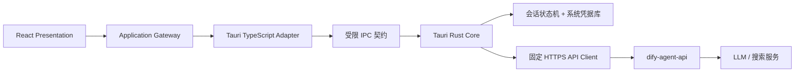

# Tauri 桌面端一次性迁移与交付方案

## 1. 决策与目标

将 `dify-agent` 从唯一的 `browser-spa` 运行目标一次性迁移为唯一的 `tauri-desktop` 运行目标。桌面应用仅交付本地安装包；不保留浏览器生产部署、浏览器 Runtime Config、浏览器 API Proxy、HTTP Gateway 或双实现回退路径。

迁移后的安全边界如下：



React 只负责呈现、交互和 Application Gateway；Rust Core 是唯一远程 I/O 与凭据所有者。WebView 永远不直接访问 API，且永远不会得到 access token、refresh token 或 Cookie。应用采用单实例、单主窗口模型；第二次启动仅激活已有窗口，不创建第二个进程或第二个会话状态机。

本方案的设计目标是消除已知的浏览器运行时假设与安全缺口，并通过契约、自动化测试和发布门禁把剩余风险变成可验证的失败条件。它不承诺不可证伪的“零风险”，但不接受已知缺陷、兼容分支或待偿技术债进入发布。签名更新能力是首发必需能力，而不是后续补充；这是严格 API 摘要校验得以长期运行的必要前提。

## 2. 代码事实与迁移前提

当前前端为 Rspack + React 浏览器 SPA：

- `src/app/router/app-router.tsx` 使用 `createBrowserRouter`，依赖 Web 服务器的 history fallback；桌面静态资源协议不能承载此假设。
- `src/app/bootstrap/runtime-config.ts` 从同源 `/runtime-config.json` 拉取 API 地址；这属于静态 Web 制品的部署模型。
- `src/shared/http/http-client.ts` 通过浏览器 `fetch`、`credentials: include` 和内存 bearer token 调用 API。
- `src/modules/auth/infrastructure/http-auth-gateway.ts` 使用服务端 HttpOnly refresh Cookie 恢复会话。
- `src/modules/chat/infrastructure/http-chat-gateway.ts` 在浏览器端解析 SSE，并以类型断言接受不可信 JSON。

当前后端为本地凭据认证与 SSE 聊天 API：

- 认证登录、刷新和注销接口通过 `Set-Cookie` 传递可轮换 refresh token。
- API handler 仅在请求携带 `Origin` 时检查白名单；Rust native HTTP client 不携带 `Origin`，因此不依赖 WebView CORS 行为。
- 聊天 API 的全局请求超时为 10 秒，HTTP Server 写超时为 15 秒；这不能支持可靠的 LLM SSE。
- 聊天 `model` 是客户端任意字符串，后端直接传递给 LLM；WebView 不是可信授权边界。

因此，“直接把 SPA 装进 WebView 并继续 fetch API”不是可接受方案。它会将 Cookie、Origin、CORS 与 WebView 的跨平台差异变成生产依赖，并继续暴露令牌和上游模型选择。

## 3. 迁移中必须消除的缺陷

### 3.1 后端流式超时

`dify-agent-api/internal/platform/config/config.go` 的 `RequestTimeout` 默认 10 秒，`cmd/api/main.go` 的 `http.Server.WriteTimeout` 默认 15 秒。当前 SSE 聊天在正常模型首字节或长回答时会被中断。

修复要求：

1. 普通 API 保留短请求超时。
2. 聊天路由使用独立的首字节、空闲和总流时限，并配置并发上限。
3. 不通过关闭全局超时解决流式问题。
4. 上游 LLM HTTP client 明确设置连接、首字节、空闲、总流与取消策略。
5. 慢客户端、断开连接、应用取消、上游断流和达到总时限必须释放 goroutine、连接和配额。

### 3.2 模型、工具与搜索边界

当前 `ChatRequest.model` 可由客户端传入任意字符串，服务端会使用该字符串调用供应商。这会绕过产品模型层级与成本控制。当前 `tools` 字段在契约中存在，但未形成完整的供应商调用能力。

修复要求：

1. 用 `ChatModelId` 枚举替换任意 `model` 字符串，例如 `flash` 和 `pro`。
2. 真实供应商模型名只由服务端配置和映射表拥有，桌面端不能传递或推导。
3. 删除未端到端实现的 `tools` 契约、类型、代码与测试；未来实现时建立新的完整 vertical slice。
4. `web_search` 默认关闭。首次启用前明确提示用户最后一条问题将发给外部搜索服务。
5. 搜索请求、结果数量、结果长度与超时必须由服务端限制；搜索错误和供应商响应原文不得写入日志。

### 3.3 输入、SSE 与错误契约

后端聊天 handler 目前未拒绝未知 JSON 字段，且 OpenAPI 中消息条数没有上限。前端 SSE 解析将 `JSON.parse` 结果直接断言为应用事件。这与“不可信边界完整校验”不一致。

修复要求：

1. OpenAPI 明确规定消息数、单条字符数、总字符数、模型枚举和未知字段行为。
2. 后端 Transport 与 Application 层均执行输入限制；不可只依赖桌面端校验。
3. 为 SSE 定义版本化帧契约：`text_delta`、`done`、`error` 三种事件，以及明确的字段、大小和终态规则。
4. Rust Core 在网络边界解析并校验每个 SSE 帧；只将已校验事件通过 IPC 转发。
5. 每条流必须恰好以一个 `done` 或 `error` 终结；取消是本地终态，不把不完整响应误报为成功。
6. API 成功 envelope 中的 `code` 必须与 HTTP 状态一致；Core 对成功和失败响应均验证该不变量。

### 3.4 会话与生命周期

当前 `useChat` 在抽屉关闭、路由卸载或会话失效时不保证取消流；当前 `useAuthSession` 无限期缓存恢复结果。这在桌面多窗口、休眠恢复与 native 任务环境下会产生悬挂任务和陈旧会话。

修复要求：

1. Core 维护单一 `SessionManager`，对 refresh 使用 single-flight 锁，防止并发轮换使 refresh token 失效。
2. access token 仅位于 Rust 进程内存；使用具备清理语义的 secret 类型，日志与 Debug 输出禁止包含 Secret。
3. refresh token 只保存在 OS Keychain、Windows Credential Manager 或 Linux Secret Service；按 API Origin 摘要分隔开发、测试、生产凭据。
4. 收到轮换 Cookie 后，先验证 Cookie 属性，再写入凭据库。写入失败时使用新 Cookie 调用 logout 撤销服务端会话，然后清除内存和本地凭据。
5. Core 主动发出定向 `session-invalidated` 事件；前端清除 Query、取消聊天并回到登录状态。
6. 用户主动 logout 是不可取消的本地清理事务。登录、注册、恢复和聊天则必须传播取消。
7. 每个聊天任务使用不可预测的 request ID；Core 只向发起窗口发送事件。关闭抽屉、登出、窗口关闭和应用退出都取消对应 native task。
8. 应用启用单实例约束。它消除多进程同时 refresh 的竞争；窗口创建、导航和弹窗默认拒绝，除主窗口外没有可调用认证或聊天 IPC 的窗口。
9. refresh 请求已在服务端轮换但应用在写入凭据库前崩溃时，旧 refresh token 已失效。下次启动必须安全地回到登录页，不能为“恢复会话”引入旧 token 宽限、双 token 或补偿兼容逻辑。

### 3.5 路由、模块与死代码

当前存在主页抽屉、`ChatRoute`、`ChatPanel` 和 `IdleComposer` 等多套聊天呈现，且 `auth` presentation 深层导入 `chat` presentation。这既造成重复，又违反跨模块只能使用显式公开契约的规则。

修复要求：

1. 采用当前实际被 E2E 使用的“认证后工作台 + 侧边聊天抽屉”作为唯一体验。
2. 删除 `/chat` 路由、`ChatRoute`、`ChatPanel`、`IdleComposer`、无调用样式和对应测试。
3. 将认证后工作台移到 `app` 组合层，`auth` 只拥有身份能力，`chat` 只拥有聊天能力。
4. 切换为 `createHashRouter`，所有内部跳转使用 Router `Link` 或导航 API；禁止 `href="/"` 触发静态资源深链刷新。
5. `useChat` 增加卸载清理；抽屉关闭必须显式停止流。

### 3.6 日志、文档与设计规范

当前上游 LLM 非 200 响应会把响应体拼入 error，后续被 handler 记录，可能把用户内容或供应商敏感信息写入日志。当前架构文档、后端架构文档、Profile、认证 ADR 与浏览器运行模型相关表述也会在桌面切换后失效。

修复要求：

1. 上游错误使用稳定错误码和安全 request ID；日志不得包含上游响应体、提示词、消息、Cookie、Authorization、完整邮箱或 token。
2. 同一变更更新前端 Profile 与 Schema、后端 Profile 与 Schema、ADR、OpenAPI、Runbook、数据分类、SLO、风险矩阵、架构图和 CI。
3. 删除所有 `browser-spa`、Chromium-only、浏览器 Runtime Config 与 `HttpClient` 的运行时描述，不保留历史描述作为当前规范。
4. 以 `docs/apple-design-spec.md` 为 UI 唯一事实源，消除现有架构文档、E2E 断言与 CSS 实现中的冲突；业务 CSS 只消费语义 Token。

### 3.7 严格契约与更新发布闭环

现有 Profile 和 Runtime Config 以 OpenAPI SHA-256 锁定前后端契约。若桌面应用严格比对 `/version` 返回的摘要，却没有签名更新通道，任何 API 契约演进都会让已经安装的客户端永久 fail-closed。将 updater 延后与严格摘要校验相互矛盾。

修复要求：

1. 首发即交付签名 updater、稳定更新地址、离线安装包和发布 Runbook。
2. updater 根公钥随签名应用包发布；更新 manifest、制品哈希和更新签名必须独立于业务 API。
3. API Origin 是长期稳定的 HTTPS 主机名。区域切换和灾备通过该主机名后的 DNS、负载均衡和证书运维完成，不能通过可编辑客户端配置切换 Origin。
4. 后端契约摘要发生变化时，先发布已签名的桌面更新，验证更新可用、可安装和可回滚，再发布新 API。旧客户端发现摘要不一致后只能进入“需要更新”状态，不能继续调用 API。
5. 更新签名密钥轮换必须由当前受信签名更新完成；发生根密钥失效时使用经平台代码签名验证的完整安装包与明确的撤销 Runbook，不伪造兼容 manifest。
6. API 版本生命周期通过新的明确版本与发布计划管理，不在同一路径上保留未记录的旧行为或前端兼容判断。

### 3.8 桌面数据边界与 WebView 威胁模型

桌面应用不等于可信前端。注入到 WebView 的脚本仍能调用被授权的 IPC command，因此 command 的 Rust 输入验证、服务端授权和能力最小化不可被 CSP 或“关闭 DevTools”替代。

修复要求：

1. IPC 登录字段、聊天文本和错误类型不得实现 `Debug`、不得进入日志、panic 输出或崩溃上报。
2. 生产 CSP 禁止 renderer 连接外网和加载远程脚本；开发 CSP 只为本地 HMR 临时放宽，生产制品不得继承该规则。
3. 本期不持久化聊天记录、输入草稿、用户资料或语言偏好；它们只在 React 内存中存在，关闭应用即清除。唯一持久化项是系统凭据库中的 refresh token。
4. 浏览器版本的 Cookie、缓存和会话不迁移到桌面端。首次桌面登录是一次明确的重新认证，不建立数据迁移桥。
5. 用户登出时先尽力向服务端撤销当前 refresh session，随后无条件清除内存与系统凭据。进程在网络失败或崩溃后不能保留可重试的明文 refresh token 队列。

## 4. 最终实现

### 4.1 Rust Core

`src-tauri` 仅包含下列职责：

```text
src-tauri/src/
├── main.rs                 # Tauri 组装与窗口生命周期
├── bootstrap-config.rs     # 已校验、签名包内配置
├── api-client.rs           # 固定 HTTPS endpoint 与 envelope 校验
├── session-manager.rs      # token、刷新、凭据库、失效事件
├── secure-store.rs         # OS 凭据库 Port 与平台实现
├── chat-stream.rs          # SSE 解析、背压、取消和定向事件
├── update-manager.rs       # 签名更新检查、安装与稳定错误码
├── commands/
│   ├── auth.rs             # register/login/restore/logout
│   └── chat.rs             # start/cancel
└── ipc.rs                  # 唯一 IPC 类型与生成入口
```

允许的 IPC command 只有：

| Command         | 输入                                        | 输出                       |
| --------------- | ------------------------------------------- | -------------------------- |
| `auth_register` | 受限注册字段                                | 最小用户视图或稳定错误码   |
| `auth_login`    | 邮箱和密码                                  | 最小用户视图或稳定错误码   |
| `auth_restore`  | 无                                          | 用户视图、匿名或稳定错误码 |
| `auth_logout`   | 无                                          | 成功或稳定错误码           |
| `chat_start`    | request ID、受限消息、产品模型 ID、搜索开关 | 接受或稳定错误码           |
| `chat_cancel`   | 仅当前窗口拥有的 request ID                 | 成功或稳定错误码           |

不得增加泛化 HTTP、文件、Shell、URL、Method、Header、路径或 operation ID command。Capabilities 默认拒绝所有权限，仅允许主窗口调用这些 command 与接收其定向事件。更新检查和安装完全在 Rust Core 内部执行，不向 WebView 暴露任意下载或安装 command。

### 4.2 IPC 与前端 Adapter

Rust IPC 类型是唯一来源，生成 TypeScript command binding、event type 和零漂移检查。React 端的 `TauriAuthGateway` 与 `TauriChatGateway` 实现现有 Application Gateway；组件、Hook 和 Presentation 不得直接调用 Tauri API。

删除：

- `src/shared/http/http-client.ts` 与测试。
- `HttpAuthGateway`、`HttpChatGateway` 与其测试。
- 浏览器 `runtime-config.ts` fetch 路径及 `public/runtime-config.json`。
- Rspack `/api/v1` proxy。

保留并调整：

- Application Gateway 的业务语义与稳定错误码。
- React Query 作为前端用户视图缓存，但由 native `session-invalidated` 事件主动失效。
- LifecycleScope 的取消语义，扩展为取消 Core 的 request ID。

### 4.3 配置、TLS 与契约锁定

生产 API 配置是签名安装包内的资源，不是可独立替换的 Web runtime 文件。配置仅含：

- API 根 URL。
- API contract ID。
- OpenAPI SHA-256。
- desktop release ID。
- 固定更新服务根地址与 updater 公钥。

构建时从锁定 OpenAPI artifact 生成 Rust contract 常量，禁止手写或复制摘要。Core 启动时校验配置格式、HTTPS、根路径与契约字段，并调用 `/api/v1/version` 比对服务端 contract ID 和 digest；不匹配时先检查签名更新，更新成功后重启并重新验证。更新不可用时显示稳定的“需要更新”故障页，拒绝认证和聊天。

开发环境可使用 Git 忽略的本地配置，但必须通过同一 Schema 校验。生产环境不允许通过命令行、环境变量、WebView 或用户可编辑文件替换 API Origin 或更新根地址。API Origin 变更只能随签名应用更新发布；正常灾备切换保持同一 Origin。

TLS 使用系统信任链与标准证书验证；不实施叶证书 pinning，避免正常证书轮换导致客户端不可恢复。不得跳过证书错误。

### 4.4 后端 API 切换

后端保持一个 API 实现，不增加桌面专用兼容 API。认证 endpoint 继续使用现有 Cookie 传递模型，但由 Rust Core 在 native 边界处理 Cookie 值；Cookie 不进入 WebView。

移除浏览器客户端后，`DIFY_AGENT_CORS_ALLOWED_ORIGINS` 可以为空；空值的语义是拒绝全部浏览器 Origin。native 请求没有 Origin，不依赖 CORS。CORS 仍作为拒绝浏览器跨域调用的防护，而不是保留历史 Web 域名的配置。

## 5. 构建、测试与发布

### 5.1 构建脚本

最终 `package.json` 提供：

```text
pnpm desktop:dev
pnpm desktop:build
pnpm rust:format:check
pnpm rust:clippy
pnpm rust:test
pnpm rust:supply-chain
pnpm verify
```

Rspack 只作为 Tauri 的 `beforeDevCommand` 与 `beforeBuildCommand`。`pnpm build` 构建桌面制品，不再产生浏览器部署制品。前端体积预算继续检查实际 WebView 入口资产，但脚本必须从构建 manifest 发现产物，不能硬编码旧 `main.js` 与 `main.css` 文件名。

### 5.2 自动化证据

| 层级                 | 必测内容                                                                               |
| -------------------- | -------------------------------------------------------------------------------------- |
| TypeScript 单元/组件 | Hash 路由、登录错误、会话失效、抽屉关闭取消、键盘与焦点、无 token 渲染                 |
| Rust 单元            | 配置、Cookie 验证、凭据库失败补偿、single-flight refresh、错误映射、IPC 参数限制       |
| Rust 集成            | TLS 失败、HTTP envelope 不一致、SSE 分段、背压、取消、错误终态和窗口定向事件           |
| 后端契约/集成        | 非法模型、未知字段、长度/条数上限、流式超时、上游错误脱敏、搜索隐私与取消              |
| 跨仓 E2E             | 真实 API + PostgreSQL + 桌面包的登录、重启恢复、聊天、停止、登出、会话撤销、契约不匹配 |
| 安全                 | 依赖漏洞、许可证、SBOM、Secret、Rust audit、Capabilities 与 CSP 负向测试               |

浏览器 Chromium E2E 不得作为桌面验收替代。桌面 E2E 必须启动实际 Tauri 应用并验证 native IPC、凭据库隔离、单实例、窗口生命周期、契约不匹配时的强制更新及更新后重新验证。

### 5.3 平台与发布

首发支持矩阵必须在开始实现前由 owner 确认。每个声明支持的平台必须在原生 runner 上完成构建、安装包 smoke test 和签名验证：

- macOS arm64 / x64：Developer ID 签名和 notarization。
- Windows x64：Authenticode 签名与安装包验证。
- Linux x64：目标发行版的 Secret Service 可用性、包格式和桌面集成验证。

自动更新属于首发范围。发布前必须具备签名更新源、manifest 与制品哈希验证、暂停放量、前向回滚、签名密钥轮换、紧急撤销 Runbook，以及离线安装包恢复路径。更新失败不得降级为继续访问摘要不匹配 API。

## 6. 一次性切换步骤

1. 建立桌面迁移 ADR，冻结本文件的决策、平台矩阵、稳定 API Origin 与更新密钥所有者。
2. 建立并演练签名 updater、离线安装包、契约不匹配强制更新和签名密钥轮换流程。
3. 在后端完成聊天输入、模型授权、流式超时、SSE 契约、日志脱敏与 CORS 空 allowlist 语义；更新 OpenAPI 摘要。
4. 同步前端锁定 artifact，生成 API 类型；建立 Rust IPC 生成链、单实例 Core、SessionManager、系统凭据库和 updater。
5. 将前端 Gateway 一次性切换到 Tauri Adapter，改为 Hash 路由并收敛为单一工作台聊天体验。
6. 删除浏览器网络实现、Web runtime 配置、浏览器发布脚本、重复 UI、失效测试和过时文档。
7. 扩展 `pnpm verify`、后端 verify 与 CI 到 Rust、原生桌面 E2E、更新、签名和跨仓测试。
8. 仅在所有目标平台门禁、签名、更新演练与安装包 smoke test 通过后发布首个桌面制品。

主分支只合并完整切换后的实现。不得使用 feature flag、浏览器 fallback、双会话实现、长期 adapter 或未完成的预留 command 来分担迁移风险。

## 7. 完成条件

迁移完成的判定条件如下：

1. Profile、Schema、架构文档、ADR、契约、测试、CI 与实际运行目标全部一致。
2. WebView 没有 API 网络权限、令牌访问能力、持久化凭据能力或泛化 native 权限。
3. 所有 API 与 IPC 不可信输入在唯一边界严格验证，且错误不泄露敏感内容。
4. 聊天流在正常、取消、超时、断连、失败和背压条件下释放全部资源并具有确定终态。
5. 不存在浏览器生产交付、旧 HTTP Gateway、重复聊天 UI、死文件、失效依赖或兼容桥。
6. 契约不匹配必然进入已验证的签名更新流程，不能让已安装客户端无恢复路径或继续调用不匹配 API。
7. 每个声明支持的平台均有通过的原生构建、签名、安装、更新、E2E 和安全供应链证据。
