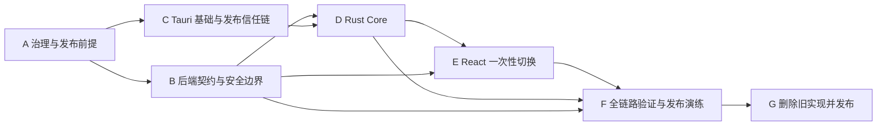

# Tauri 桌面端迁移开发任务拆分

## 1. 使用方式与边界

本清单将 [Tauri 桌面端一次性迁移与交付方案](./Tauri桌面端一次性迁移与交付方案.md) 拆解为可执行工作包。所有任务默认进度为 `未开始`；实际实施时只能将状态更新为 `进行中`、`阻塞` 或 `已完成`，并在任务行补充对应 PR、命令和结果摘要。

这是一次运行目标切换，不是渐进式双端支持。实现可在迁移分支上按阶段推进，但主分支只接受完成全部删除、验证和发布演练后的完整切换，不保留浏览器 fallback、兼容 Gateway、临时 Feature Flag 或未授权 IPC command。

状态定义：

| 状态     | 含义                                                   |
| -------- | ------------------------------------------------------ |
| `未开始` | 尚未开始实施，不能据此宣称能力可用。                   |
| `进行中` | 正在修改，尚未达到任务完成定义。                       |
| `阻塞`   | 缺少明确 owner 输入、签名材料、目标平台或外部服务。    |
| `已完成` | 代码、测试、文档和列出的验证均通过，且没有遗留旧实现。 |

## 2. 阶段、顺序与主依赖

关键顺序不可调整：

1. 先冻结 API、签名、平台和迁移边界，再建立实现。
2. 先修复服务端可被任意客户端绕过的安全与流式问题，再让桌面端调用它。
3. 先建立签名更新链和固定 IPC 契约，再切换 React Gateway。
4. 先通过真实桌面包与跨仓 E2E，再删除浏览器实现并发布。

## 3. A 阶段：治理、平台与发布前提

| ID   | 开发任务                                                                                          | 前置依赖 | 责任域    | 进度     | 完成定义与验证                                                                     |
| ---- | ------------------------------------------------------------------------------------------------- | -------- | --------- | -------- | ---------------------------------------------------------------------------------- |
| A-01 | 建立桌面迁移 ADR，锁定单桌面运行目标、无浏览器回退、会话边界与 API 版本策略。                     | 无       | 架构      | `未开始` | ADR、前后端 Profile、Schema 和架构图一致；执行 Profile/Schema 严格校验。           |
| A-02 | 确认首发平台矩阵、bundle identifier、稳定 API Origin、更新服务 Origin 和支持期限。                | A-01     | 发布      | `未开始` | owner 书面确认 macOS/Windows/Linux 范围及架构，不接受“默认支持全部平台”。          |
| A-03 | 建立签名材料所有权、权限隔离、密钥轮换和紧急撤销 Runbook。                                        | A-02     | 安全/发布 | `未开始` | macOS、Windows、Tauri updater 密钥均不进入仓库；演练记录可审计。                   |
| A-04 | 固定 Rust stable、Tauri、Node、pnpm、原生系统依赖与 CI runner 版本。                              | A-02     | 构建      | `未开始` | 本机和各目标 runner 均可输出版本证明；锁文件和工具链检查覆盖 Rust。                |
| A-05 | 清理现有规范漂移：浏览器叙述、过时 OIDC 说明、Apple 设计规范与 CSS/E2E 冲突、既有 HTML 格式失败。 | A-01     | 架构/前端 | `未开始` | `pnpm format:check`、instructions/profile/diagram 检查全绿；不保留“历史当前规范”。 |
| A-06 | 建立跨仓迁移分支、契约同步节奏、发布责任人与阻断升级路径。                                        | A-01     | 交付      | `未开始` | 前端、`dify-agent-api`、更新服务的版本关系、owner 和停止发布条件写入 Runbook。     |

## 4. B 阶段：后端契约、安全与流式语义

| ID   | 开发任务                                                                                | 前置依赖                                             | 责任域    | 进度     | 完成定义与验证                                                                                  |
| ---- | --------------------------------------------------------------------------------------- | ---------------------------------------------------- | --------- | -------- | ----------------------------------------------------------------------------------------------- |
| B-01 | 重定义 `ChatRequest`：产品级 `ChatModelId` 枚举、消息数量/长度/总量上限和禁止未知字段。 | A-01                                                 | API/后端  | `未开始` | OpenAPI、生成 Go/TS 类型、错误码与正负向契约测试同步；不接受任意供应商模型字符串。              |
| B-02 | 删除未实现的 `tools` 字段及其生成物、测试和文档。                                       | B-01                                                 | API/后端  | `未开始` | 全仓搜索无遗留 transport、UI、注释或配置；没有空能力占位。                                      |
| B-03 | 将供应商模型映射收敛在后端受校验配置，按产品模型 ID 明确映射。                          | B-01                                                 | 后端/安全 | `未开始` | 篡改桌面请求无法选择未授权模型；模型映射和成本策略有单一 owner 与测试。                         |
| B-04 | 让聊天 Transport 与 Application 共同执行 JSON 严格解码、字段限制和业务边界校验。        | B-01                                                 | 后端      | `未开始` | 未知字段、空内容、越界长度、越界消息数、非法角色和非法模型均有稳定失败测试。                    |
| B-05 | 定义版本化 SSE 帧契约、终态规则、最大帧大小和 HTTP envelope 状态一致性。                | B-01                                                 | API/后端  | `未开始` | `text_delta`、`done`、`error` 可由唯一 Schema 生成/校验；每条流恰好一个终态。                   |
| B-06 | 重构聊天路由超时与并发模型：普通 API 短超时，聊天有首字节、空闲、总时限和连接释放。     | B-05                                                 | 后端      | `未开始` | 长流、慢客户端、断连、取消、配额耗尽和上游卡住均无 goroutine/连接泄漏；不关闭全局保护绕过问题。 |
| B-07 | 重构 LLM 与搜索外部 I/O：明确超时、取消、大小限制、错误分级和脱敏日志。                 | B-06                                                 | 后端/安全 | `未开始` | 日志/trace 不含 prompt、响应体、token、Cookie 或完整 PII；上游失败仅返回稳定错误码。            |
| B-08 | 建立 Web Search 明示同意、默认关闭、服务端资源限制和失败路径。                          | B-04                                                 | 产品/后端 | `未开始` | 首次启用有 i18n 隐私文案；最后用户消息外发、取消、超时和服务不可用均经测试。                    |
| B-09 | 将 CORS allowlist 改为“空列表拒绝全部浏览器 Origin”，保留 native 无 Origin 调用。       | A-01                                                 | 后端/安全 | `未开始` | 配置 Schema、启动校验、CORS/Origin 负向测试和 Runbook 同步；不保留废弃 Web 域名。               |
| B-10 | 更新 `/version` 与后端发布流程，使桌面端能够严格比较当前契约并触发更新。                | B-05                                                 | API/发布  | `未开始` | contract ID/digest 与制品、OpenAPI artifact、前端生成物一致；不匹配测试 fail-closed。           |
| B-11 | 完成后端生成物、Profile、文档和完整 verify。                                            | B-02, B-03, B-04, B-05, B-06, B-07, B-08, B-09, B-10 | 后端      | `未开始` | API 生成漂移、格式、静态分析、race、契约、集成和安全门禁均通过。                                |

## 5. C 阶段：Tauri 基础、配置与发布信任链

| ID   | 开发任务                                                                                             | 前置依赖         | 责任域    | 进度     | 完成定义与验证                                                                                |
| ---- | ---------------------------------------------------------------------------------------------------- | ---------------- | --------- | -------- | --------------------------------------------------------------------------------------------- |
| C-01 | 初始化 `src-tauri`，建立精确锁定的 Cargo workspace、禁止 unsafe、Rust 格式/Clippy/测试脚本。         | A-04             | 桌面/构建 | `未开始` | 空壳可在目标平台原生构建；`cargo fmt --check`、Clippy `-D warnings`、测试和供应链检查可运行。 |
| C-02 | 将前端 Profile、Schema、toolchain check、package scripts 和 CI 从 browser-spa 切换为 tauri-desktop。 | A-01, C-01       | 架构/构建 | `未开始` | `desktop:dev`、`desktop:build`、Rust 门禁进入 `pnpm verify`；无浏览器生产脚本。               |
| C-03 | 建立构建期 desktop config Schema 与生成链，从锁定 OpenAPI 生成 Rust contract 常量。                  | B-10, C-01       | 桌面/构建 | `未开始` | 生产 config 只在签名包内；开发 config Git 忽略且同 Schema 校验；不手写摘要。                  |
| C-04 | 配置单实例、单主窗口、窗口尺寸/关闭生命周期、导航拦截和弹窗拒绝策略。                                | C-01             | 桌面/安全 | `未开始` | 第二实例只聚焦主窗口；没有未授权新窗口、外部导航或跨窗口 IPC。                                |
| C-05 | 建立最小 Tauri Capabilities 与生产/开发 CSP 策略。                                                   | C-04             | 桌面/安全 | `未开始` | 生产 renderer 无 API 网络、Shell、文件和任意插件权限；CSP 负向测试覆盖远程脚本与连接。        |
| C-06 | 接入签名 updater、稳定更新服务、离线安装包和更新状态机。                                             | A-03, A-04, C-01 | 发布/桌面 | `未开始` | manifest、哈希、签名、暂停放量、回滚、密钥轮换和离线恢复均有自动化/演练证据。                 |
| C-07 | 实现“API 摘要不匹配 -> 检查签名更新 -> 重启复验 -> 需要更新故障页”的启动流程。                       | B-10, C-03, C-06 | 桌面      | `未开始` | 更新不可用时 API command 被拒绝；更新成功后只在复验通过时进入应用。                           |

## 6. D 阶段：Rust Core 与受限 IPC

| ID   | 开发任务                                                                                                   | 前置依赖                           | 责任域    | 进度     | 完成定义与验证                                                                                |
| ---- | ---------------------------------------------------------------------------------------------------------- | ---------------------------------- | --------- | -------- | --------------------------------------------------------------------------------------------- |
| D-01 | 定义 Rust 为唯一来源的 IPC 类型、生成 TypeScript binding/event 类型及零漂移检查。                          | B-01, B-05, C-01                   | 桌面/前端 | `未开始` | 不手写重复 Rust/TS IPC 模型；生成类型覆盖 command 输入、输出、事件和稳定错误码。              |
| D-02 | 实现固定 HTTPS API Client：仅允许认证、版本和聊天 endpoint，校验 TLS、状态码、envelope 与响应 Schema。     | B-10, C-03, D-01                   | 桌面      | `未开始` | 没有任意 URL/Method/Header command；证书错误、状态不一致、畸形 JSON 和超时均 fail-closed。    |
| D-03 | 实现 OS 凭据库 Port 与 macOS、Windows、Linux 平台适配，隔离 API Origin。                                   | A-02, C-01                         | 桌面/安全 | `未开始` | refresh token 只存在系统凭据库；测试使用 fake Port，生产不回退到文件、Store 或 WebView 存储。 |
| D-04 | 实现 `SessionManager`：内存 access token、single-flight refresh、Cookie 属性验证、轮换失败补偿和失效事件。 | B-10, D-02, D-03                   | 桌面/安全 | `未开始` | 并发恢复只发送一次 refresh；Keychain 写入失败会撤销新会话；崩溃后安全要求重新登录。           |
| D-05 | 实现受限认证 commands：register、login、restore、logout，区分可取消与不可取消操作。                        | D-01, D-04                         | 桌面      | `未开始` | WebView 不接收 token/Cookie/后端原文；logout 无论网络结果都清除本地凭据。                     |
| D-06 | 实现聊天流 Core：受限输入、SSE Schema 校验、背压、request ID 所有权、定向事件和取消。                      | B-05, B-06, D-01, D-02, D-04       | 桌面      | `未开始` | 关闭、登出、取消、错误、断流和终态均释放 task；旧窗口或错误 request ID 无法读取事件。         |
| D-07 | 建立 native 安全错误模型、结构化脱敏日志和最小化诊断指标。                                                 | D-02, D-04, D-06                   | 桌面/安全 | `未开始` | 密码、消息、token、Cookie、完整邮箱不进入日志、panic、telemetry 或崩溃报告。                  |
| D-08 | 完成 Rust 单元、集成、负向和供应链测试。                                                                   | D-02, D-03, D-04, D-05, D-06, D-07 | 桌面/质量 | `未开始` | 覆盖凭据库失败、轮换、取消、TLS、畸形事件、背压、并发、窗口归属和 IPC 滥用。                  |

## 7. E 阶段：React 一次性切换与旧实现删除

| ID   | 开发任务                                                                                            | 前置依赖               | 责任域    | 进度     | 完成定义与验证                                                                          |
| ---- | --------------------------------------------------------------------------------------------------- | ---------------------- | --------- | -------- | --------------------------------------------------------------------------------------- |
| E-01 | 以 `createHashRouter` 替换 BrowserRouter，并将所有内部链接改为 Router 导航。                        | C-02                   | 前端      | `未开始` | 直接打开、刷新和返回 hash 深链均正确；不存在硬编码根路径跳转。                          |
| E-02 | 将认证后工作台放到 `app` 组合层，保留唯一抽屉聊天体验。                                             | E-01                   | 前端/架构 | `未开始` | `auth` 不深层导入 `chat` presentation；模块只经显式 public contract 交互。              |
| E-03 | 删除 `/chat`、`ChatRoute`、`ChatPanel`、`IdleComposer`、无调用 CSS/测试和关联 Module Catalog 条目。 | E-02                   | 前端      | `未开始` | 全仓无死 UI、死路由、失效 i18n key 或不再被调用的依赖。                                 |
| E-04 | 实现 `TauriAuthGateway`、`TauriChatGateway` 与生成 IPC binding 的组合根。                           | D-01, D-05, D-06, E-02 | 前端      | `未开始` | 组件/Hook 不直接 invoke；Application Gateway API 不暴露 native 或 transport DTO。       |
| E-05 | 将启动、会话恢复、Query 失效和“需要更新”故障页切换为 Core 事件与状态。                              | C-07, D-04, E-04       | 前端      | `未开始` | 删除 `/runtime-config.json` fetch；会话失效自动取消聊天并返回登录，静态启动错误可访问。 |
| E-06 | 为聊天 Hook 实现 native request ID、抽屉关闭/卸载/登出取消和确定终态渲染。                          | D-06, E-04             | 前端      | `未开始` | 不存在悬挂流、重复事件或停止后继续写入；键盘、焦点、错误和无障碍路径通过。              |
| E-07 | 增加 Web Search 外发提示、更新状态文案和安全错误 i18n；不持久化聊天、草稿、用户资料或语言。         | B-08, E-05             | 前端/产品 | `未开始` | 所有新文案中英完整；无 localStorage、sessionStorage、IndexedDB 或可读 Cookie。          |
| E-08 | 依 Apple 设计 Token 修复现有 CSS、视觉测试与实现冲突。                                              | A-05, E-02             | 前端/设计 | `未开始` | 无硬编码业务色值、无违规玻璃/阴影/渐变；键盘、缩放、对比度和 reduced-motion 均验证。    |
| E-09 | 删除 `HttpClient`、HTTP Gateway、浏览器 Runtime Config、dev proxy、Chromium-only E2E 和废弃脚本。   | E-04, E-05, E-06       | 前端/构建 | `未开始` | `rg` 不存在旧运行时术语和代码；依赖、测试、文档和 CI 同步删除。                         |

## 8. F 阶段：全链路质量、CI 与发布演练

| ID   | 开发任务                                                                                            | 前置依赖                                       | 责任域    | 进度     | 完成定义与验证                                                                       |
| ---- | --------------------------------------------------------------------------------------------------- | ---------------------------------------------- | --------- | -------- | ------------------------------------------------------------------------------------ |
| F-01 | 迁移 TypeScript 单元、组件和架构测试到 Tauri Gateway 与单一工作台。                                 | E-03, E-04, E-05, E-06, E-07, E-08             | 前端/质量 | `未开始` | 旧 HTTP mock 测试已删除；新测试能失败于旧浏览器实现。                                |
| F-02 | 建立真实桌面应用 E2E：登录、重启恢复、聊天、停止、登出、会话撤销、Hash 路由和 a11y。                | D-08, E-09                                     | 桌面/质量 | `未开始` | 不用 Chromium SPA 测试代替 native E2E；每个首发平台有运行证据。                      |
| F-03 | 建立跨仓 E2E 环境：签名测试包、真实 Go API、PostgreSQL 和隔离凭据库。                               | B-11, F-02                                     | 后端/桌面 | `未开始` | 契约不匹配、后端升级、刷新轮换和搜索隐私负向路径均可复现。                           |
| F-04 | 将 Rust、Tauri 构建、原生 E2E、签名验证、SBOM、漏洞、许可证和 Secret 检查加入 `pnpm verify` 与 CI。 | C-02, D-08, F-01, F-02                         | 构建/安全 | `未开始` | Ubuntu 不能代替 macOS/Windows/Linux runner；所有 Required Check 名称稳定且阻断合并。 |
| F-05 | 验证签名 updater：正常更新、损坏 manifest、哈希不符、签名不符、暂停放量、更新中断、回滚和离线恢复。 | C-06, C-07, F-04                               | 发布/安全 | `未开始` | API 摘要不一致时，唯一恢复路径是经验证更新或离线签名安装包。                         |
| F-06 | 完成 macOS notarization、Windows Authenticode、Linux 包与 Secret Service 的原生 smoke test。        | A-03, A-04, F-04                               | 发布      | `未开始` | 每个声明支持的平台有可安装、可启动、可登录、可更新和可卸载的证据。                   |
| F-07 | 完成性能、资源与故障恢复验收：WebView 预算、启动、休眠恢复、内存、聊天背压和网络切换。              | D-06, E-09, F-02                               | 桌面/质量 | `未开始` | 预算和 SLO 更新为桌面可观测指标；无未解释 warning、泄漏或 flaky 测试。               |
| F-08 | 同步全部治理资产和发布 Runbook，并完成预发布演练审查。                                              | A-05, B-11, C-07, E-09, F-04, F-05, F-06, F-07 | 架构/发布 | `未开始` | 交叉引用、Mermaid 渲染、Profile/Schema、文档格式和完整 verify 全部通过。             |

## 9. G 阶段：一次性切换与完成判定

| ID   | 开发任务                                                                                    | 前置依赖                           | 责任域     | 进度     | 完成定义与验证                                                                                             |
| ---- | ------------------------------------------------------------------------------------------- | ---------------------------------- | ---------- | -------- | ---------------------------------------------------------------------------------------------------------- |
| G-01 | 审计迁移分支：确认没有浏览器发布能力、旧网络栈、兼容桥、死文件、失效依赖或未完成 TODO。     | B-11, C-07, D-08, E-09, F-08       | 架构/质量  | `未开始` | 对旧文件名、旧脚本、`fetch`、`HttpClient`、`browser-spa`、Chromium-only E2E 和旧配置键执行全仓零结果检查。 |
| G-02 | 执行跨仓 release candidate：签名包、更新 manifest、真实 API、数据库、各平台安装与完整门禁。 | F-03, F-04, F-05, F-06, F-07, F-08 | 发布       | `未开始` | 所有 Required Check、签名、原生 E2E、契约和安全证据无 warning、skip、flaky 或未解释失败。                  |
| G-03 | 主分支一次性合并与受控发布；发布后验证 updater、API 摘要、登录、聊天与撤销路径。            | G-01, G-02                         | 发布/owner | `未开始` | 发布记录、制品摘要、监控、停止放量条件和回滚/离线恢复入口完整。                                            |

## 10. 完备性反思与质疑

### 10.1 方案问题是否被任务覆盖

| 方案最终问题                         | 覆盖任务                     | 复核结论                                                               |
| ------------------------------------ | ---------------------------- | ---------------------------------------------------------------------- |
| WebView 直接联网、Cookie/CORS 不稳定 | C-05、D-02、E-04、E-09       | 已覆盖：WebView 无 API 网络权限，Rust 固定 API Client 是唯一远程 I/O。 |
| access/refresh token 泄漏或轮换竞争  | C-04、D-03、D-04、D-05、F-03 | 已覆盖：单实例、single-flight、系统凭据库和失败补偿形成闭环。          |
| LLM 流被超时中断或泄漏资源           | B-05、B-06、B-07、D-06、F-07 | 已覆盖：服务端和 Core 分别拥有协议/资源边界，不能只修一端。            |
| 篡改客户端选择高成本模型或隐含工具   | B-01、B-02、B-03、B-04       | 已覆盖：模型授权收敛服务端，未实现能力直接删除。                       |
| SSE 不可信内容、终态不确定           | B-05、D-02、D-06、F-02       | 已覆盖：唯一帧 Schema、双边界校验和取消测试。                          |
| 严格契约摘要造成旧客户端不可恢复     | A-03、C-06、C-07、F-05、G-03 | 已覆盖：签名 updater 是首发阻断项，摘要不匹配不能静默继续。            |
| 深链、重复 UI、跨模块依赖和死代码    | E-01、E-02、E-03、E-09、G-01 | 已覆盖：Hash 路由和工作台单实现为唯一形态。                            |
| 文档、Profile、CI 与实现漂移         | A-05、B-11、C-02、F-04、F-08 | 已覆盖：治理资产和 executable checks 同时更新。                        |

### 10.2 仍需拒绝的伪完成情形

以下任一情况都不是完成，必须保持任务 `阻塞` 或 `进行中`：

1. 只把 React 包进 Tauri，却仍让 WebView `fetch` API。
2. 只实现 Keychain，而未实现单实例、single-flight refresh、Cookie 轮换失败补偿和崩溃后的安全重新登录。
3. 只改前端 SSE，而未修复后端 10 秒请求超时、15 秒写超时、模型越权和输入边界。
4. 只在 Ubuntu 或 Chromium 验证，而没有目标平台原生包、签名、安装、更新和 E2E 证据。
5. 只增加 updater 依赖，却没有签名 manifest、密钥轮换、暂停放量、离线恢复和契约不匹配测试。
6. 为了拆分 PR 而把浏览器 HTTP Gateway、旧路由或兼容分支留在主分支。
7. 声称 Linux/Windows/macOS 支持，却没有对应平台凭据库与签名验证记录。

### 10.3 最终结论

该拆分覆盖了方案的运行时、安全、契约、后端资源控制、前端切换、测试、供应链和发布闭环。每个实现任务都有明确前置依赖与完成验证；任何依赖未完成都阻断后续切换任务。

残余风险不应通过兼容代码消化，而应通过 A-02、A-03、F-05、F-06 和 G-02 的平台验证、签名演练和发布所有者确认关闭。只有 G-03 完成，且 G-01/G-02 全部通过时，桌面化迁移才可以描述为完成。
